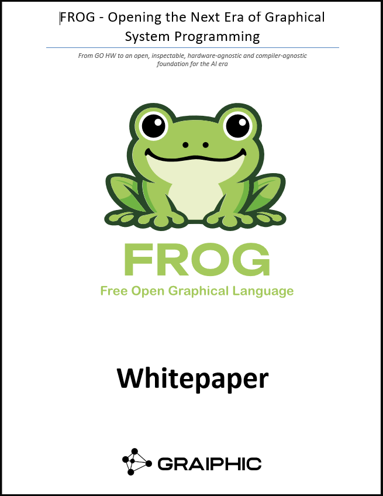

  

  

<h1 align="center">FROG — Opening the Next Era of Graphical System Programming</h1>

  <strong>From GO HW to an open, inspectable, hardware-agnostic and compiler-agnostic foundation for the AI era</strong>

  <a href="./FROG_Whitepaper_1.2.pdf">Download the PDF</a> ·
  <a href="./Heilmeier.md">Heilmeier framing</a> ·
  <a href="https://github.com/Graiphic/FROG">FROG specification repository</a> ·
  <a href="../README.md">GO Whitepaper Series</a>

<h2>Overview</h2>

FROG is Graiphic’s foundation whitepaper for the next era of graphical dataflow programming.
It explains why the ambition initiated with <strong>SOTA GO</strong> and extended through <strong>GO HW</strong> now moves deeper into the language layer itself.

SOTA GO showed that graphs can become the source of truth for AI workflows.
GO HW showed that graph orchestration can reach systems, hardware, monitoring, deployment, and energy-aware execution.
FROG carries those ideas into an open graphical language foundation built around canonical <code>.frog</code> source, validated meaning, open FIR, lowering, backend contracts, runtime families, compiler corridors, hardware bridges, front panels, widgets, and AI-era inspectability.

The objective is not merely to build another graphical tool.
The objective is to open a new category of industrial programming infrastructure:
<strong>graphical dataflow as an open, inspectable, AI-ready, hardware-agnostic and compiler-agnostic language foundation</strong>.

<h2>Download and Navigation</h2>

<ul>
  <li><a href="./FROG_Whitepaper_1.0.pdf">Download the FROG whitepaper PDF</a></li>
  <li><a href="./Heilmeier.md">Open the FROG Heilmeier framing</a></li>
  <li><a href="https://github.com/Graiphic/FROG">Open the FROG specification repository</a></li>
  <li><a href="https://graiphic.github.io/FROG/">Open the FROG specification GitHub Pages</a></li>
  <li><a href="../README.md">Return to the Graiphic GO Whitepaper Series</a></li>
</ul>

<h2>Contents</h2>

<ul>
  <li><a href="#overview">Overview</a></li>
  <li><a href="#download-and-navigation">Download and Navigation</a></li>
  <li><a href="#why-this-whitepaper-exists">Why This Whitepaper Exists</a></li>
  <li><a href="#heilmeier-framing">Heilmeier Framing</a></li>
  <li><a href="#the-missing-zone-frog-targets">The Missing Zone FROG Targets</a></li>
  <li><a href="#main-thesis">Main Thesis</a></li>
  <li><a href="#what-frog-adds-to-the-go-trajectory">What FROG Adds to the GO Trajectory</a></li>
  <li><a href="#why-frog-matters-in-the-ai-era">Why FROG Matters in the AI Era</a></li>
  <li><a href="#what-makes-frog-different">What Makes FROG Different</a></li>
  <li><a href="#current-public-proof">Current Public Proof</a></li>
  <li><a href="#relationship-with-the-frog-specification-repository">Relationship with the FROG Specification Repository</a></li>
  <li><a href="#who-should-read-this-whitepaper">Who Should Read This Whitepaper?</a></li>
  <li><a href="#call-for-ecosystem-participation">Call for Ecosystem Participation</a></li>
  <li><a href="#repository-contents">Repository Contents</a></li>
  <li><a href="#contact">Contact</a></li>
</ul>

<h2 id="why-this-whitepaper-exists">Why This Whitepaper Exists</h2>

FROG should be read as a continuation of Graiphic’s graph-orchestration trajectory, not as a replacement for it.

The earlier GO whitepapers were built around ONNX as the graph artifact, ONNX Runtime as the execution layer, and SOTA as the visual orchestration environment.
FROG moves one layer deeper.
Instead of depending on a closed third-party graphical language substrate, FROG defines an open graphical dataflow language foundation.

<pre><code>.frog canonical source
    -&gt;
validated program meaning
    -&gt;
open FIR
    -&gt;
lowering
    -&gt;
backend contract
    -&gt;
runtime family / compiler corridor / hardware bridge
    -&gt;
target execution
</code></pre>

This architecture is central to the FROG thesis:
the language remains upstream, while execution becomes modular downstream.

<h2 id="heilmeier-framing">Heilmeier Framing</h2>

The companion <a href="./Heilmeier.md">FROG Heilmeier framing</a> explains the program logic behind the whitepaper in a mission-oriented format.
It clarifies what Graiphic is trying to do, why the problem matters now, what is new, who should care, what success would change, and what still needs to be proved.

The Heilmeier page should be read as the strategic bridge between the whitepaper and the public FROG specification repository.
It does not replace the normative specification.
It explains why FROG matters as a technological program: open graphical dataflow, post-AI accountability, open FIR, runtime and compiler modularity, hardware agnosticism, ecosystem participation, and industrial sovereignty.

<ul>
  <li><a href="./Heilmeier.md">Open the FROG Heilmeier framing</a></li>
</ul>

<h2 id="the-missing-zone-frog-targets">The Missing Zone FROG Targets</h2>

  

  <em>
    FROG targets the zone where accessibility meets system-grade execution:
    graphical dataflow, open source artifacts, hardware agnosticism, and deployment depth.
  </em>

Modern software still forces an old trade-off.
Syntax-first languages can deliver determinism, performance, deep control, compiler maturity, and deployment seriousness, but they often impose high implementation friction and poor structural visibility at system scale.
Accessible visual environments can reduce friction, but they often remain product-bound, runtime-bound, hardware-bound, or too shallow for serious industrial deployment.

FROG is designed to break that trade-off by combining a precise open source language artifact for machines with a graphical dataflow interface for humans.
The <code>.frog</code> source can be parsed, generated, versioned, validated, transformed, and lowered.
The graphical interface can expose the same program as nodes, wires, front panels, widgets, probes, indicators, and observability overlays.

<h2 id="main-thesis">Main Thesis</h2>

<blockquote>
  

    <strong>
      FROG aims to make graphical dataflow behave like language infrastructure:
      source, meaning, FIR, lowering, backend handoff, conformance, runtime families, compiler corridors, hardware bridges, and human-scale inspection.
    </strong>
  

</blockquote>

FROG is not only a graphical interface.
It is a proposal for an open industrial language stack where the saved source is structured, the graph is inspectable, the execution-facing representation is open, and downstream execution is modular.

<h2 id="what-frog-adds-to-the-go-trajectory">What FROG Adds to the GO Trajectory</h2>

<h3>SOTA GO</h3>

SOTA GO established the operational visual environment for ONNX-native graph authoring, training, optimization, deployment, and orchestration inside LabVIEW.
It demonstrated the value of a graphical cockpit for AI workflows.

<h3>GO HW</h3>

GO HW extended that graph-based approach beyond AI inference toward system behavior:
hardware primitives, I/O, timing, monitoring, deployment, energy awareness, and heterogeneous targets.

<h3>FROG</h3>

FROG continues the GO HW ambition on stronger ground.
The goal is not to remove the SOTA and GO HW technology layers from Graiphic’s roadmap.
The goal is to give them a deeper and freer foundation.

The following concepts remain in scope and are intended to move progressively into the FROG world:

<ul>
  <li>model execution,</li>
  <li>graph execution,</li>
  <li>inference and training orchestration,</li>
  <li>preprocessing and postprocessing graphs,</li>
  <li>hardware primitives,</li>
  <li>device profiles,</li>
  <li>target deployment,</li>
  <li>runtime monitoring,</li>
  <li>energy-aware observability,</li>
  <li>remote supervision.</li>
</ul>

The difference is that these capabilities are intended to move from a LabVIEW-orchestrated corridor into Graiphic’s own open graphical language stack.

<h2 id="why-frog-matters-in-the-ai-era">Why FROG Matters in the AI Era</h2>

Generative AI makes software faster to produce, but not automatically easier to inspect.
A coding agent can generate large amounts of source quickly.
The industrial question is no longer simply whether AI should generate code.
The real question is how humans can inspect, validate, control, and take responsibility for software produced or transformed at machine speed.

FROG addresses that challenge by combining two complementary representations:

<ul>
  <li><strong>machine-facing source</strong> — open, structured <code>.frog</code> artifacts that can be generated, parsed, versioned, validated, transformed, and lowered;</li>
  <li><strong>human-facing inspection</strong> — graphical dataflow views that expose structure through nodes, wires, layout, color, hierarchy, front panels, probes, watches, and observability overlays.</li>
</ul>

The result is a controlled co-production loop:
machines can generate structured <code>.frog</code> source, and humans can inspect the resulting system graphically before accepting it for execution.

<h2 id="what-makes-frog-different">What Makes FROG Different</h2>

<table>
  <thead>
    <tr>
      <th>Property</th>
      <th>Meaning</th>
      <th>Why it matters</th>
    </tr>
  </thead>
  <tbody>
    <tr>
      <td><strong>Open source artifact</strong></td>
      <td>Programs are represented through structured <code>.frog</code> source.</td>
      <td>AI tools, validators, version control systems, and compilers can work on a precise artifact.</td>
    </tr>
    <tr>
      <td><strong>Graphical dataflow interface</strong></td>
      <td>The same source can be rendered as nodes, wires, structures, widgets, and front panels.</td>
      <td>Human inspection happens at system scale rather than only through linear syntax review.</td>
    </tr>
    <tr>
      <td><strong>Open FIR</strong></td>
      <td>FROG Intermediate Representation is the open execution-facing bridge.</td>
      <td>Runtime families, compiler corridors, and hardware bridges can attach downstream without owning the language.</td>
    </tr>
    <tr>
      <td><strong>Runtime plurality</strong></td>
      <td>Different runtime families can serve different targets and operating modes.</td>
      <td>Small targets do not need heavy IDE runtimes, and development machines are not limited to minimal embedded runtimes.</td>
    </tr>
    <tr>
      <td><strong>Compiler plurality</strong></td>
      <td>FROG is designed for multiple downstream compiler corridors.</td>
      <td>The language can remain upstream while execution is optimized for each target.</td>
    </tr>
    <tr>
      <td><strong>Hardware agnosticism</strong></td>
      <td>Hardware vendors can implement FROG-compatible runtimes, profiles, or bridges.</td>
      <td>The ecosystem can expand without Graiphic maintaining every hardware backend alone.</td>
    </tr>
    <tr>
      <td><strong>Front-panel modernization</strong></td>
      <td>Widget packages such as <code>.wfrog</code> and scalable assets such as SVG support modern UI realization.</td>
      <td>Front panels can become portable, inspectable, themeable, and suitable for distributed supervision.</td>
    </tr>
  </tbody>
</table>

<h2 id="current-public-proof">Current Public Proof</h2>

The FROG specification repository already defines a layered language architecture and includes bounded proof corridors.
The most important current anchor is <strong>Example 05 — Bounded UI Accumulator</strong>.

<pre><code>main.frog
    -&gt;
ui/accumulator_panel.wfrog
    -&gt;
main.fir.json
    -&gt;
main.lowering.json
    -&gt;
backend-family contract
    -&gt;
shared runtime-family acceptance
    -&gt;
Python / Rust / C-C++ runtime-family consumers
    -&gt;
first downstream LLVM proof
</code></pre>

This is a bounded proof, not proof of full maturity.
It shows corridor integrity from source to execution-facing artifacts and runtime-family consumers.

<h2 id="relationship-with-the-frog-specification-repository">Relationship with the FROG Specification Repository</h2>

This whitepaper and the companion Heilmeier page are strategic and explanatory.
The normative specification work lives in the FROG repository.

<ul>
  <li><a href="https://github.com/Graiphic/FROG">FROG root repository</a></li>
  <li><a href="https://graiphic.github.io/FROG/">FROG GitHub Pages</a></li>
  <li><a href="https://github.com/Graiphic/FROG/tree/main/IR">FROG IR architecture</a></li>
  <li><a href="https://github.com/Graiphic/FROG/tree/main/Examples/05_bounded_ui_accumulator">Example 05 bounded corridor</a></li>
  <li><a href="https://github.com/Graiphic/FROG/tree/main/Implementations/Reference/Runtime">Reference runtime family</a></li>
  <li><a href="./Heilmeier.md">FROG Heilmeier framing in this repository</a></li>
</ul>

<h2 id="who-should-read-this-whitepaper">Who Should Read This Whitepaper?</h2>

<ul>
  <li>senior technical leaders,</li>
  <li>industrial software architects,</li>
  <li>compiler and runtime engineers,</li>
  <li>hardware vendors,</li>
  <li>test and measurement specialists,</li>
  <li>robotics and automation teams,</li>
  <li>AI infrastructure teams,</li>
  <li>research laboratories,</li>
  <li>universities,</li>
  <li>strategic partners and investors.</li>
</ul>

<h2 id="call-for-ecosystem-participation">Call for Ecosystem Participation</h2>

Graiphic is actively seeking partners who want to help shape the next era of open graphical dataflow programming.

<ul>
  <li>Hardware vendors interested in FROG-compatible runtimes or profiles.</li>
  <li>Runtime and compiler specialists willing to build execution bridges around open FIR.</li>
  <li>Industrial sponsors willing to co-fund proof corridors and target demonstrations.</li>
  <li>Research laboratories and universities interested in teaching and experimenting with FROG.</li>
  <li>Third-party developers interested in future widgets, toolkits, runtime packages, compiler bridges, and hardware profiles.</li>
</ul>

FROG is not only a new language.
It is a foundation for a new ecosystem:
open at the specification layer,
modular at the execution layer,
inspectable at the engineering layer,
and ambitious enough to reshape how industrial software is generated, understood, deployed, and governed.

<h2 id="repository-contents">Repository Contents</h2>

<pre><code>FROG - Opening the Next Era of Graphical/
├── Readme.md
├── Heilmeier.md
├── FROG_Whitepaper_1.0.pdf
├── FROG_cover2.png
└── frog-orville-chart.png
</code></pre>

<h2 id="contact">Contact</h2>

<ul>
  <li>Website: <a href="https://www.graiphic.io">graiphic.io</a></li>
  <li>Contact: <a href="mailto:hello@graiphic.io">hello@graiphic.io</a></li>
  <li>Funding and partnerships: <a href="mailto:funding@graiphic.io">funding@graiphic.io</a></li>
</ul>
